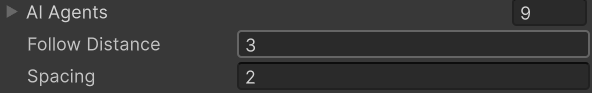
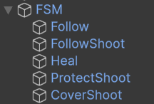
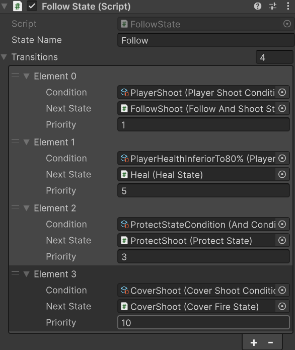
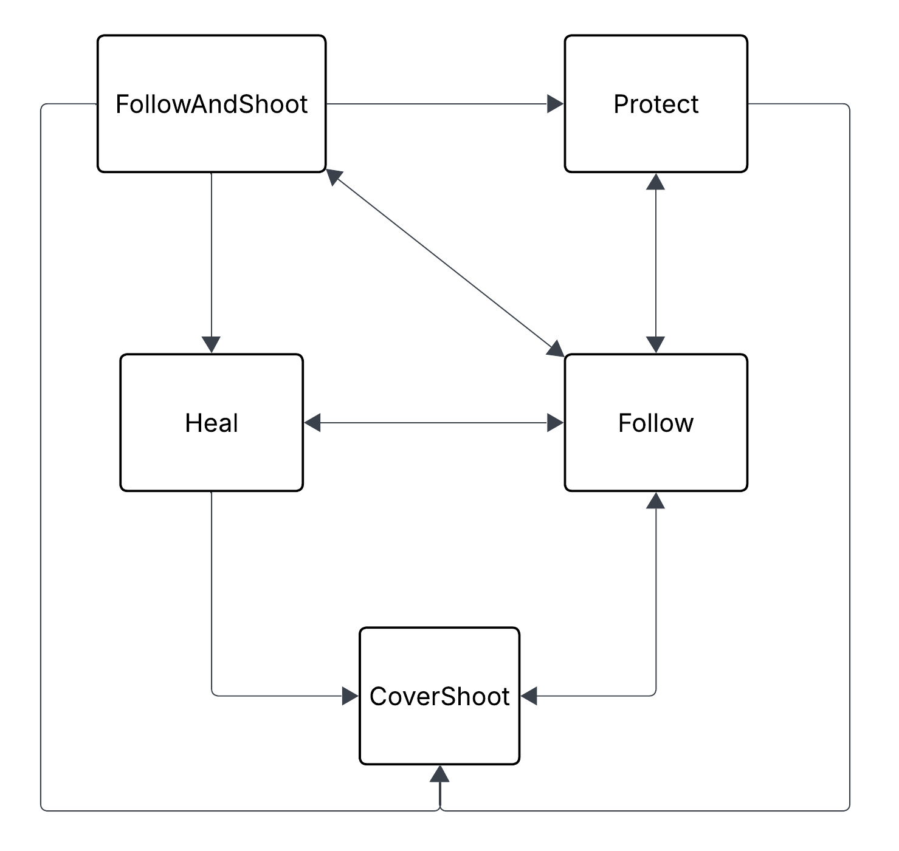
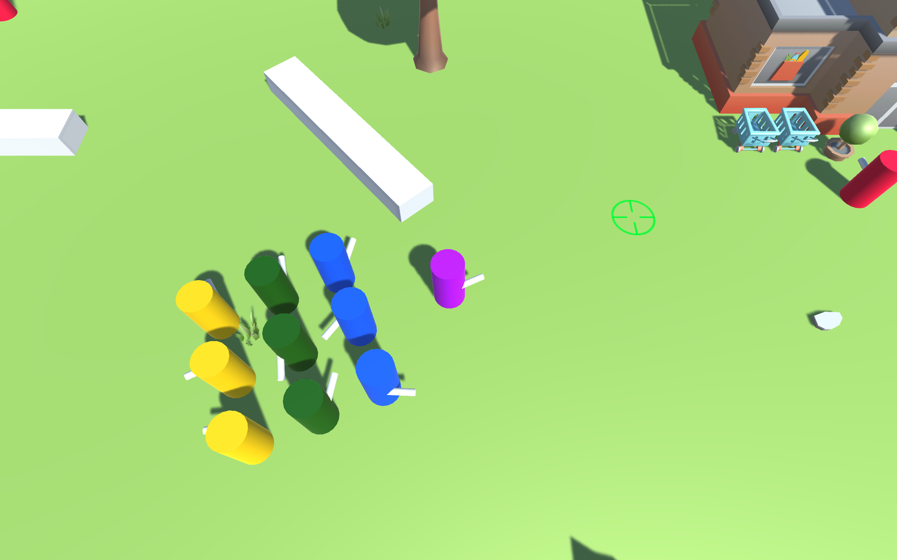
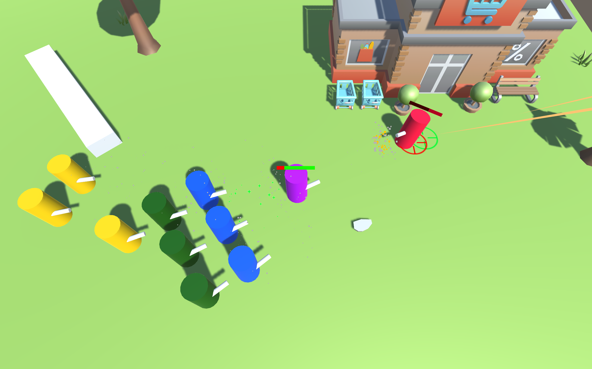
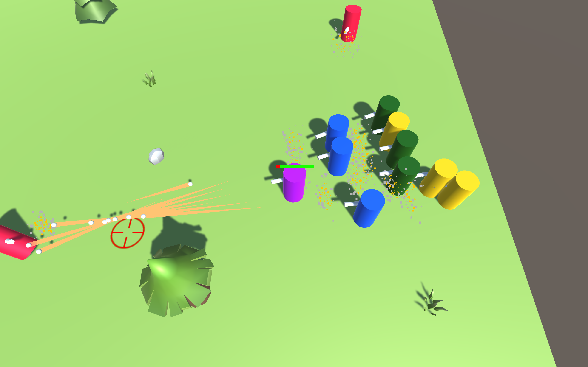
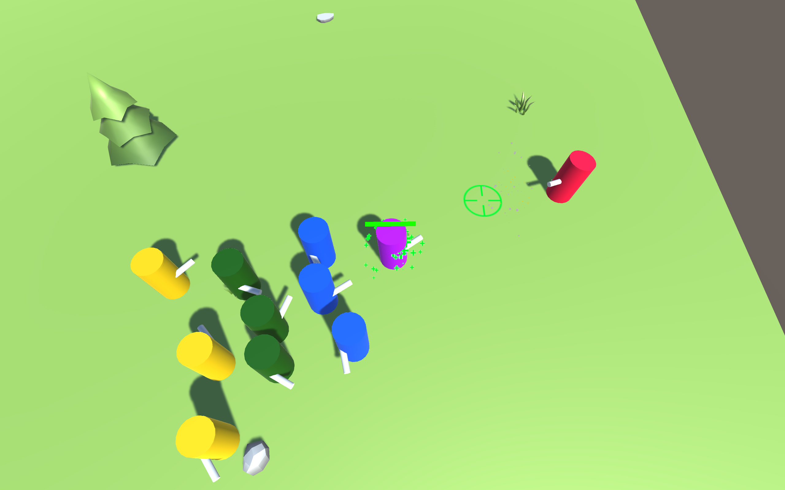
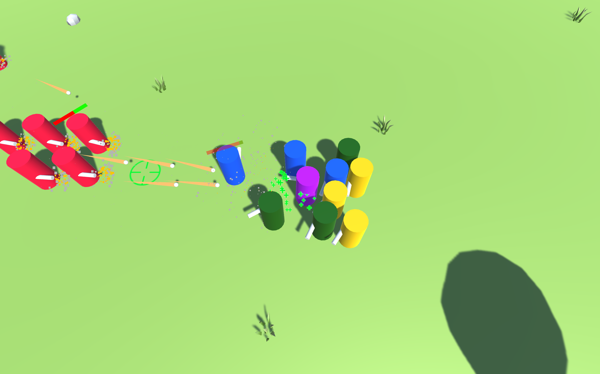
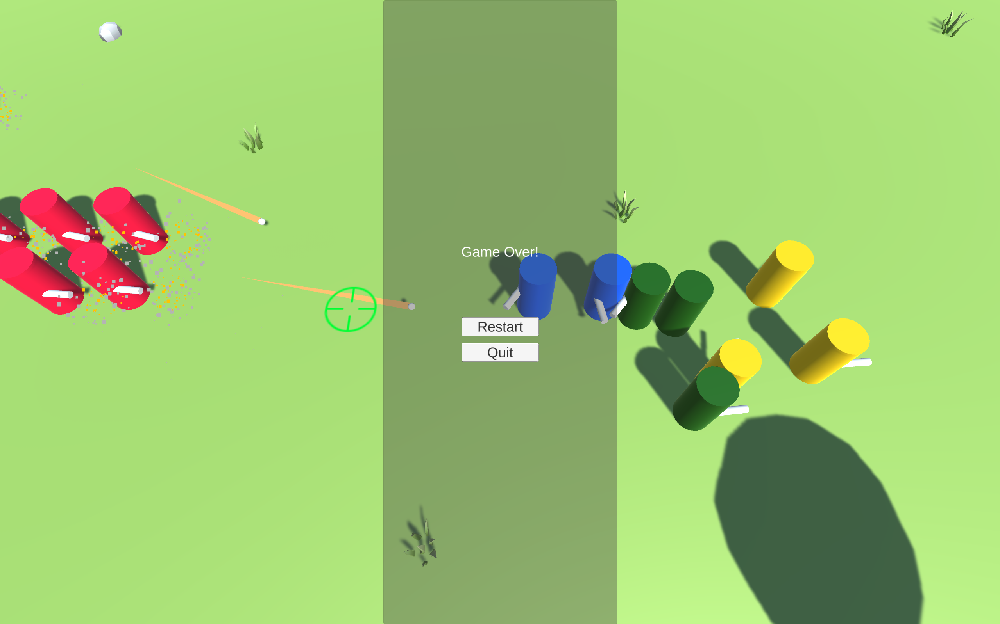

# Squad AI

## Description
A Top-Down shooter game made in Unity (version 6000.3.13f1) in 2 weeks, in a group of  programmers, at Isart Digital.

## Controls:
|    Controls   |     Action    |
|     :---:     |     :---:     |
| W - A - S - D |     Move      |
|     Mouse     |      Aim      |
|  Left click   |     Shoot     |
|  Right click  |  Cover Shoot (or Cancel)  |
|     Escape    |   Pause Game  |

## AI Documentation

### Agents
The PlayerAgent and AIAgent classes inherit from the Agent class (that takes care of movement using NavMeshAgent and shoot). PlayerAgent is controlled by the player using controls given above. AIAgents are controlled by a FSMController that updates the current state of the AI. 

The VirtualLeader class inherits from the AIAgent class, and is responsible for formation movement of multiple AIAgents. Due to that, it is also controlled by a FSMController. It has a list of all the AIAgents that compose its formation, as well as floats "FollowDistance" and "Spacing" that controls the distance at wich the formation stays from the player (for the ally squad) and the space between each member of the formation. The formation is in a rectangular shape that scales with the number of members.

*Parameters of a VirtualLeader in Unity's inspector*

### Finite State Machine Architecture

The FSM used is comprised of StateBehaviours, StateConditions and StateTransitions. The current StateBehaviour of the FSMController uses the AIAgent functions to move and act. A list of StateTransitions is stored in each StateBehaviour. A StateTransition is comprised of a StateCondition (and an instance of the given StateCondition), a reference to the next StateBehaviour and a priority (as an int). The StateCondition class inherits from ScriptableObject and implements a virtual "Validate" function that returns a bool (corresponding to the completion of the condition: true if the condition is fullfilled, false if it is not). The overriden function in children classes defines the condition, and variables that can be modified for each ScriptableObject asset allow for a condition logic to be stored as different assets. Each time the StateBehaviour updates, it checks for each StateCondition if the priority is greater than the current highest priority and if the StateCondition is validated. If a StateTransition is found to be valid, the FSMController transitions to the next state of the StateTransition, else it stays in the current state.

In the GameObject hierarchy, the FSMController is a Component of the child of the Agent, and the StateBehaviours are Components of the children of the FSMController object.

*Exemple of an ally State machine in hierarchy*

*Exemple of the Follow state in Unity's inspector*

The priority variable of StateTransition allows for different AIs to be specialized, and prioritize different states over others.

### Ally AI
Every ally has the same StateBehaviours (with StateTransitions only differing by priorities) and is one of the three specialization: "Healer", "Protector" and "Shooter" (They are represented in the project in green for Healers, blue for Protectors and yellow for Shooters, the Player being purple and the Enemies red).

For the ally AI (state machine diagram below), "Healers" have a greater priority for StateTransitions having the next state being "Heal", "Protecters" have it for the "Protect" state, and "Shooters" prioritize "FollowAndShoot". The StateTransitions towards the "CoverShoot" state have a greater priority than all the others. The state "Follow" is the other one towards which all the others can transition and it has the lowest priority of them all.

The VirtualLeader that gives out the positions in the formation to the ally AIs only has a "Follow" state, to always follow the player.

### Enemy AI

Enemy AI is much simpler than the ally one. It only has 2 states: "Follow" (following the VirtualLeader in formation) and "ShootAtPlayer" (shooting at the player while staying still).

The Decisions that allow the switch between the two are dependant on the VirtualLeader leading the enemies, that has a "Patrol" state and a "Idle" state (reached when the player is close enough to it).

## Assets
- [Environment Props](https://assetstore.unity.com/packages/3d/environments/landscapes/low-poly-cartoon-mini-pack-free-227405)

- Base unity project by Florian WOLF

## Screenshots

## Authors
- [Arthur GUÉDU](https://github.com/Arthur-GUEDU)
- [Kenzo ONDET](https://github.com/OndetKenzo)
- Marc LINDNER